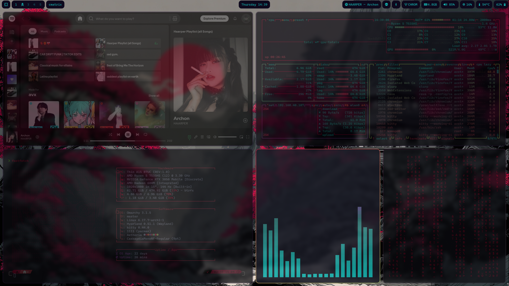

# Omarchy-Waybar
A minimal and modern Omarchy Waybar configuration designed for a clean desktop look and efficient daily use.

---

**Features:**

* Compact layout with left (workspaces), center (clock & updates), right (system info)
* Modules: CPU, memory, network, temperature, battery, audio, Bluetooth, MPRIS, tray
* Custom Omarchy launcher, update checker, and screen recording indicator
* Auto-refresh style and dynamic tooltips
* Lightweight, elegant, and fully compatible with Omarchy tools

---

---

